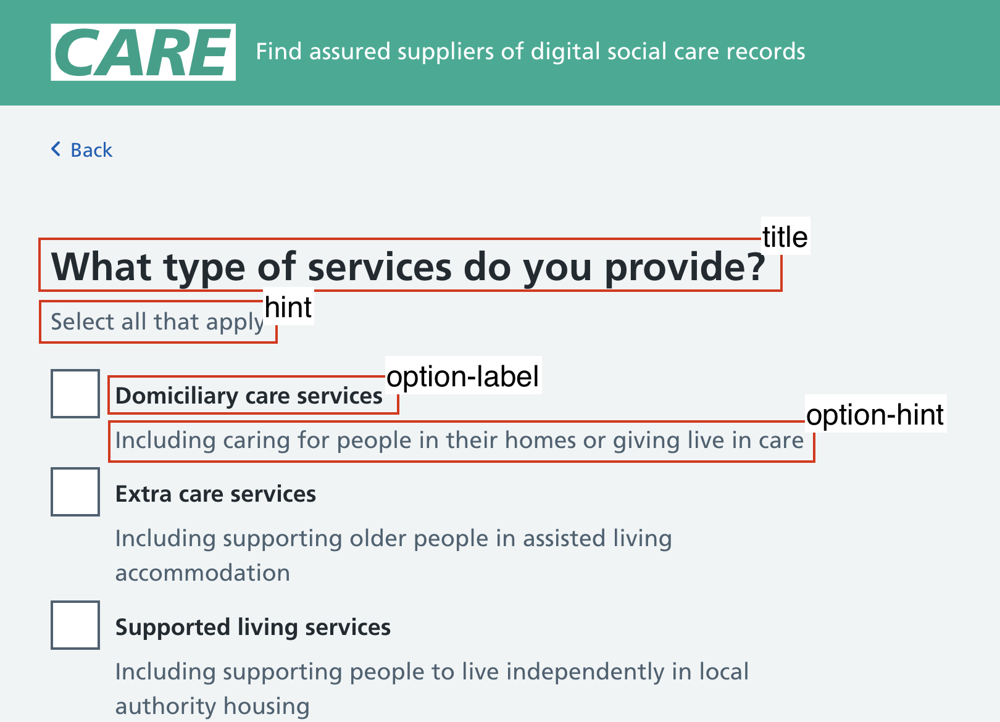

# Configure the service in Google Sheets

## Configuring form steps

Each tab in the spreadsheet corresponds to a step/question in the form (except `mappings` and `suppliers`). A step can consist of either a group of radio buttons (single choice) or checkboxes (multiple choices).

The name of the tab is used as the URL path for the step - e.g. the `care-setting` tab corresponds to `/care-setting` in the URL.

Steps are taken in the order in which their corresponding tabs are defined in the spreadsheet.

### Configuring questions

The configuration options for a step/question are defined by the values in the first row of the sheet. The following properties are defined once at a step level:

* `title` - the title of the step when displayed in recap section
* `type` - `CheckboxGroup` or `RadioGroup` 
* `label` - the title of the question displayed on the input page
* `hint` - help text displayed with question (optional)

A number of rows can also be added to list the options available in the checkbox or radio group. These should define the following properties:

* `option` - a unique identifier for this option value. These need to be unique across all steps and options.
* `option-label` - the label displayed for the option
* `option-hint` - help text displayed with the option (optional)

#### Sub-option reveals

Options in checkbox groups can be configured to show sub-options when selected.

Define sub-options by listing their values in the following columns:

* `reveal-parent` - the unique identifier of the parent checkbox that should reveal this item
* `reveal` - the unique identifier of the sub-option
* `reveal-label` - the label displayed for the sub-option
* `reveal-hint` - help text displayed with the sub-option (optional)

## Configuring suppliers

The details of each supplier are stored in the `suppliers` tab of the configuration spreadsheet. There is one row per supplier, with values in the following columns:

* `id` - a unique identifier for the supplier. This must correspond to a value in the `name` column of the `mappings` tab.
* `name` - the name of the supplier as displayed on screen
* `phone` - the supplier telephone number
* `email` - the supplier email address
* `web` - the supplier website URL. Note: this can be entered with or without `https://` prefix.
* `summary` - a text description of the supplier
* `video` - a video embed URL. Note: this should be the embedded player URL, not the webpage URL. For Vimeo videos this is of the form `https://player.vimeo.com/video/<id>`.
* `capabilities` - text content for supplier capabilities
* `integrations` - text content for supplier integrations
* `hardware` - should be set to `TRUE` if the supplier supplies devices, and `FALSE` or left blank otherwise

Note that the content for `summary`, `capabilities` and `integrations` will be rendered using [Markdown](https://www.markdownguide.org/basic-syntax/) so can include basic text formatting such as [bold and italic text](https://www.markdownguide.org/basic-syntax/#emphasis) and [bulleted lists](https://www.markdownguide.org/basic-syntax/#lists-1).

## Configuring supplier mappings

The mapping of user requirements to suppliers is stored in the `mappings` tab of the supplier configuration spreadsheet.

The rows in the spreadsheet correspond to suppliers, where the values in the `name` column are the `id` properties of the suppliers.

The remaining columns of the spreadsheet correspond to the unique identifiers for the user requirements.

The values of the cells should contain `TRUE` or `FALSE` depending on whether the particular supplier meets that requirement. If a user selects a requirement then only the suppliers which contain `TRUE` for that requirement will be included in the results.

## Deploying updates to configuration

When changes to the spreadsheet the service will need to be [rebuilt and redeployed](./building-and-running.md) for those changes to be visible in the live environment.

It is recommended to deploy to a test environment built with the same spreadsheet as the production service to test changes before releasing them.

## Next steps

* [Configure email functionality](./email-configuration.md)
